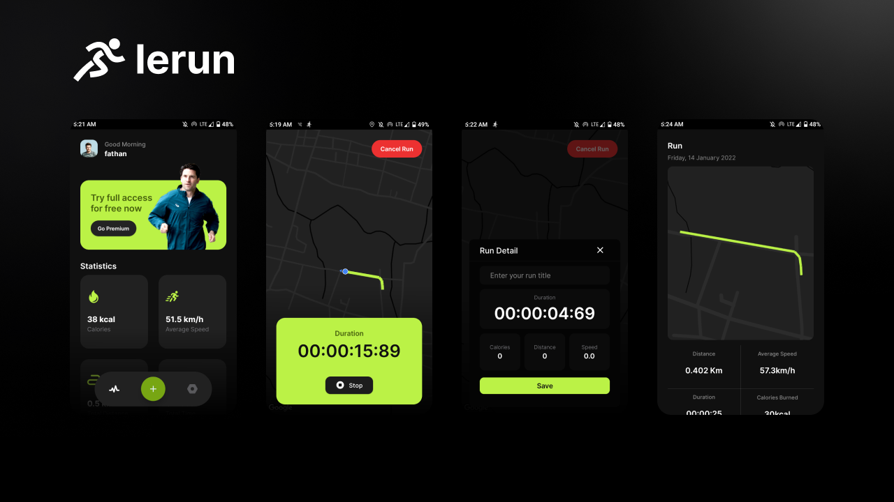

<h1 align="center">Lerun</h1>

<p align="center">  
Lerun is a running tracking application based on modern Android tech-stacks and MVVM architecture.
</p>

<p align="center">
  <a href="https://opensource.org/licenses/Apache-2.0"></a>
  <a href="https://android-arsenal.com/api?level=21"></a>
</p>

<p align="center">

</p>

## Download
Go to the [Releases](https://github.com/arrazyfathan/Lerun/releases) to download the latest APK.


## Tech stack & Open-source libraries
- Minimum SDK level 21
- [Kotlin](https://kotlinlang.org/) based, [Coroutines](https://github.com/Kotlin/kotlinx.coroutines) + [Flow](https://kotlin.github.io/kotlinx.coroutines/kotlinx-coroutines-core/kotlinx.coroutines.flow/) for asynchronous.
- [Hilt](https://dagger.dev/hilt/) for dependency injection.
- Jetpack
    - Lifecycle - dispose of observing data when lifecycle state changes.
    - ViewModel - UI related data holder, lifecycle aware.
    - Room Persistence - construct the database using the abstract layer.
- Architecture
    - MVVM Architecture
    - Repository pattern
- [Glide](https://github.com/bumptech/glide) - loading images.
- [Timber](https://github.com/JakeWharton/timber) - A logger with a small, extensible API.
- [Material-Components](https://github.com/material-components/material-components-android) - Material design components for building ripple animation, and CardView.
- [Google Maps SDK](https://developers.google.com/maps/documentation/android-sdk/overview?hl=id) - Track location and show current location user.
- [Easy Permission](https://github.com/googlesamples/easypermissions) - EasyPermissions is a wrapper library to simplify basic system permissions logic when targeting Android M or higher.

## MAD Score


# License

```xml
MIT License

Copyright (c) [2021] [Ar Razy Fathan Rabbani]

Permission is hereby granted, free of charge, to any person obtaining a copy
of this software and associated documentation files (the "Software"), to deal
in the Software without restriction, including without limitation the rights
to use, copy, modify, merge, publish, distribute, sublicense, and/or sell
copies of the Software, and to permit persons to whom the Software is
furnished to do so, subject to the following conditions:

The above copyright notice and this permission notice shall be included in
all copies or substantial portions of the Software.

THE SOFTWARE IS PROVIDED "AS IS", WITHOUT WARRANTY OF ANY KIND, EXPRESS OR
IMPLIED, INCLUDING BUT NOT LIMITED TO THE WARRANTIES OF MERCHANTABILITY,
FITNESS FOR A PARTICULAR PURPOSE AND NONINFRINGEMENT. IN NO EVENT SHALL THE
AUTHORS OR COPYRIGHT HOLDERS BE LIABLE FOR ANY CLAIM, DAMAGES OR OTHER
LIABILITY, WHETHER IN AN ACTION OF CONTRACT, TORT OR OTHERWISE, ARISING FROM,
OUT OF OR IN CONNECTION WITH THE SOFTWARE OR THE USE OR OTHER DEALINGS IN
THE SOFTWARE.
```
