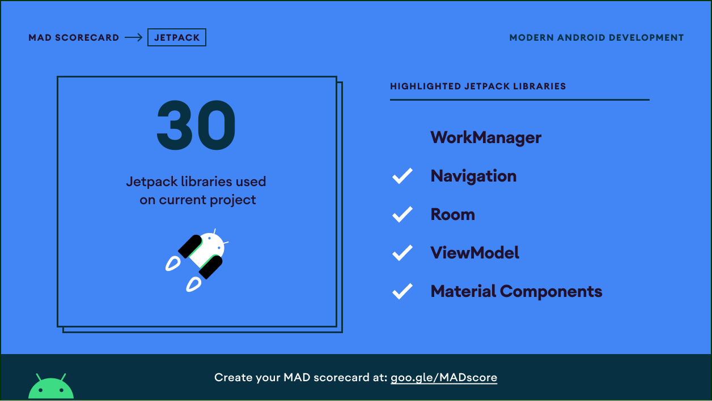

<h1 align="center">Lerun</h1>

<p align="center">  
Lerun is a running tracking application based on modern Android tech-stacks and MVVM architecture.
</p>

<p align="center">
  <a href="https://opensource.org/licenses/Apache-2.0"></a>
  <a href="https://android-arsenal.com/api?level=21"></a>
</p>

<p align="center">

</p>

## Tech stack & Open-source libraries
- Minimum SDK level 21
- [Kotlin](https://kotlinlang.org/) based, [Coroutines](https://github.com/Kotlin/kotlinx.coroutines) + [Flow](https://kotlin.github.io/kotlinx.coroutines/kotlinx-coroutines-core/kotlinx.coroutines.flow/) for asynchronous.
- [Hilt](https://dagger.dev/hilt/) for dependency injection.
- Jetpack
    - Lifecycle - dispose of observing data when lifecycle state changes.
    - ViewModel - UI related data holder, lifecycle aware.
    - Room Persistence - construct the database using the abstract layer.
- Architecture
    - MVVM Architecture
    - Repository pattern
- [Glide](https://github.com/bumptech/glide) - loading images.
- [Timber](https://github.com/JakeWharton/timber) - A logger with a small, extensible API.
- [Material-Components](https://github.com/material-components/material-components-android) - Material design components for building ripple animation, and CardView.
- [Google Maps SDK](https://developers.google.com/maps/documentation/android-sdk/overview?hl=id) - Track location and show current location user.
- [Easy Permission](https://github.com/googlesamples/easypermissions) - EasyPermissions is a wrapper library to simplify basic system permissions logic when targeting Android M or higher.

## MAD Score




# License
```xml
Designed and developed by 2021 arrazyfathan (Ar Razy Fathan Rabbani)

Licensed under the Apache License, Version 2.0 (the "License");
you may not use this file except in compliance with the License.
You may obtain a copy of the License at

   http://www.apache.org/licenses/LICENSE-2.0

Unless required by applicable law or agreed to in writing, software
distributed under the License is distributed on an "AS IS" BASIS,
WITHOUT WARRANTIES OR CONDITIONS OF ANY KIND, either express or implied.
See the License for the specific language governing permissions and
limitations under the License.
```